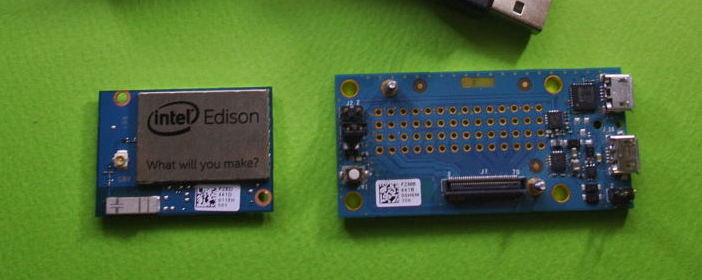
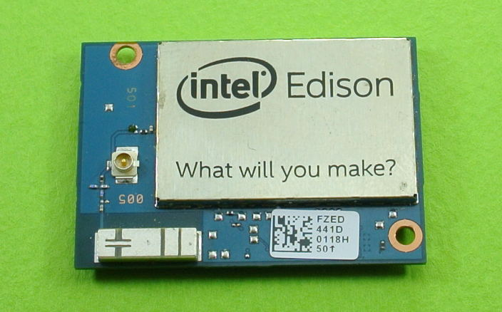
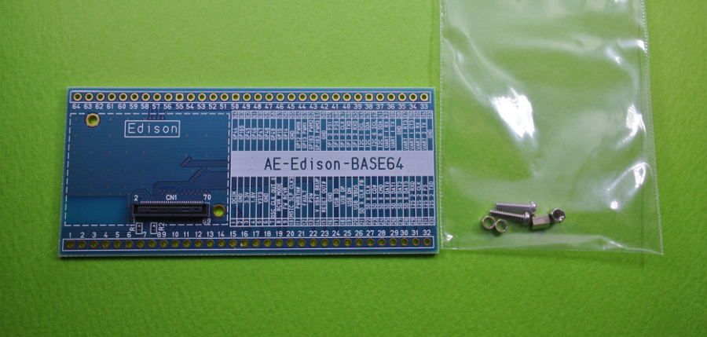

=======================================================
★ Edisonの購入
=======================================================

.. image:: ../img/intel.web.480.270.jpg
	:scale: 40%
	:target: http://www.intel.com/content/www/us/en/do-it-yourself/maker.html

.. image:: ../img/EA05.JPG
	:scale: 30%

.. image:: ../img/Edison_top_view.png
	:scale: 30%

Intel社から公式に販売されている商品は、以下の三種類になります。

Edison本体
------------------------------------------------------------------------------------------------

- こちらはEdison本体のみになります。
- Edison本体には0.4mmピッチの超小型な端子があり、本体だけれは使用出来ません。
- 後述の変換ボードやベースボード等を組み合わせて使用します。
- 販売サイト: http://akizukidenshi.com/catalog/g/gM-08569/
- 販売サイト: https://www.switch-science.com/catalog/1956/

Edison本体+BreakoutBoard
------------------------------------------------------------------------------------------------

- Edison本体とBrackoutBoardと呼ばれる小型基板がついてきます。
- BrackoutBoardには、電源コントロール、USBシリアル変換回路、

  リポバッテリー充電回路等が搭載されています。
- ただ、レベル変換等は行われていない為、殆どはLinuxを弄りたい人がメインになります。
- 後述のレベル変換を組み合わせれば、現実的な小型なLinuxボードです。
- 販売サイト: http://akizukidenshi.com/catalog/g/gM-08570/
- 販売サイト: https://www.switch-science.com/catalog/1957/

Edison本体+Arduinoベースボード
------------------------------------------------------------------------------------------------

.. image:: img/Edison02.JPG
    :width: 710px

- Edison本体に加え、Arduino風に扱うベースボードがつきます。
- Arduino風というのは、Edisonには無い機能もArduinoベースボードに乗っています。
- EdisonをArduinoとして扱いつつ、無線LANやLinuxなどの環境を組み合わせて使う際はおすすめです。
- 販売サイト: http://akizukidenshi.com/catalog/g/gM-08571/
- 販売サイト: https://www.switch-science.com/catalog/1958/

秋月電子通商　Edison　２．５４ｍｍピッチ変換基板　パーツセット
------------------------------------------------------------------------------------------------

- Edison本体は付いてこないが、Edison本体と組み合わせることが出来る。
- Edison本体の使いづらい0.4mmピッチのコネクタを2.54mmピッチに大胆に変換している。
- ブレットボードと接続出来るように40pinのピンソケットが付属している。
- Edison本体の外部回路無しの性能評価や自作基板の試作におすすめです。
- 販売サイト: http://akizukidenshi.com/catalog/g/gK-08846/

購入可能店の紹介
------------------------------------------------------------------------------------------------

- 秋月電子 : http://akizukidenshi.com/catalog/top.aspx
- スイッチサイエンス : https://www.switch-science.com/
- etc... : http://www.intel.co.jp/content/www/jp/ja/do-it-yourself/where-to-buy.html

また、Intel社以外からもEdison用関連商品が発売されております。

- (株)秋月電子通商 様

    - Grove-室内環境計測キット For Intel Edison
        - Groveと言われるケーブル接続でセンサーを繋げていくキットをEdison+Arduinoセット用に提供
        - 温湿度センサに加え、UVセンサや土壌湿度センサもあり、簡単な室内の環境計測が行えるキットセット
        - Arduino用なので、Edisonで試した後にもArduinoへ移行することも可能
        - URL: http://akizukidenshi.com/catalog/g/gK-09308/

    - Xadow ウェアラブルキット For Intel Edison
        - Xadow と言われるGroveよりも高性能なセンシングが可能となるEdison本体に接続していくキット
        - 主な使い方は、ウェアラブルを想定したタッチセンサーや加速度センサー、OLED、NFCモジュール等があり、
          更に全部を組み立てると小型の腕時計が作れると言ったデモがある。
        - URL: http://akizukidenshi.com/catalog/g/gK-09307/

- スイッチサイエンス（株） 様

    - FRISKケースに入るEdison用ベース基板 Henry
        - お菓子のFRISKのケースに入るEdison用ベース基板です。
        - FRISKケースに入れるため小型に作られておりますが、Edisonの開発に必要な機能は一通り入っています・。
        - ボードに9軸センサー（加速度3軸＋ジャイロ3軸＋磁気3軸）が乗っており、複雑なセンシングを試す際におすすめ
        - また、USBホスト機能がありますので、USBカメラをつなげて画像処理を行ったりできる
        - URL: https://www.switch-science.com/catalog/2258/

    -  Intel Edison Block 各種
        - Edisonのコネクタを利用して、Blockと呼ばれる基板を重ねて行くシリーズです。
        - ブロックはバッテリーブロックや9軸センサーブロック、I2Cバスブロック等になります。
        - URL: https://www.switch-science.com/catalog/1991/

    - スイッチサイエンス版Eaglet(MFTバージョン)
        - こちらもFRISKケースに入る小型ベースボードです。
        - 電源回路やリチウムイオン充電回路、レベル変換回路等が搭載されています
        - また、Grove-I2C製品を接続できる端子があります。
        - URL: https://www.switch-science.com/catalog/2070/

|

|

★　次のセットアップへ

.. toctree::
    :maxdepth: 1

    02
    03

|

|

提供
--------------------------------

ArtifactNoise.

.. image:: ../img/ANlogoMark02.png
	:alt: ArtifactNoise
	:scale: 40%
	:target: http://artifactnoise.com

書籍化に向けて頑張り中・・・！

管理情報
------------------------------------------------

:初版: 2015/06/18 Rev2用に執筆

:作成者: Yuta kitagami
:連絡先: kitagami@artifactnoise.com
:twitter: @nonNoise
