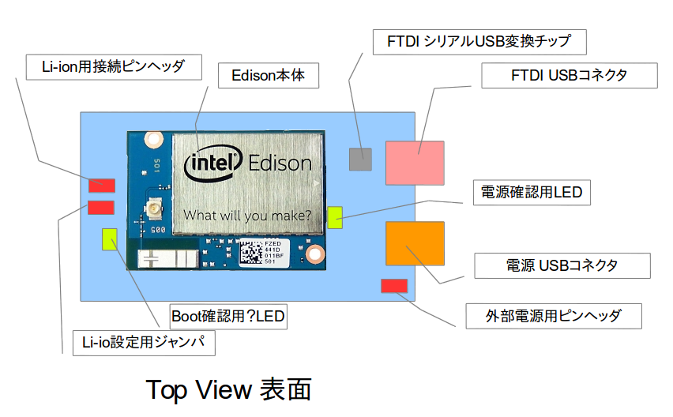
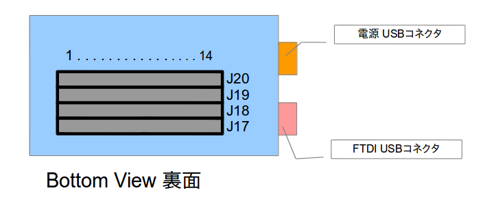
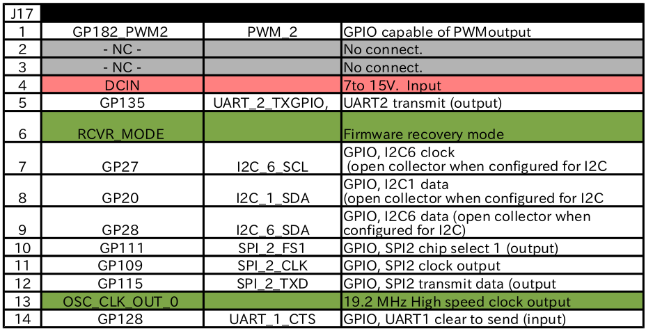
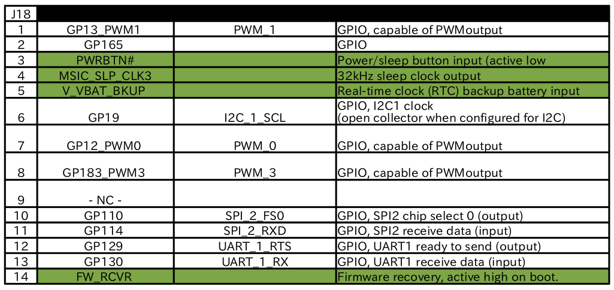
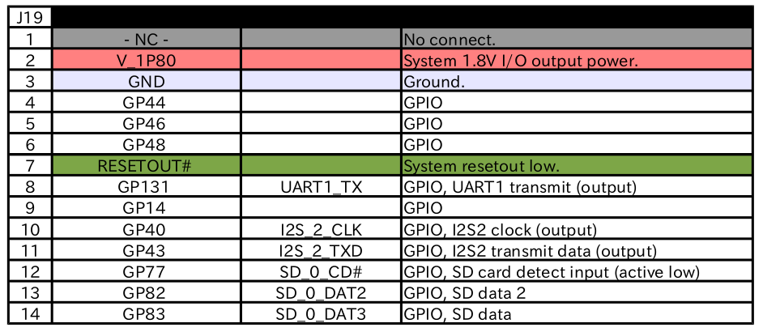
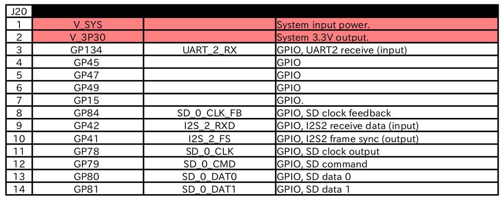

====================================================================
Edison ハードウェアについて (Breakout Board 編)
====================================================================

.. image:: img/intel.web.480.270.jpg
	:scale: 40%
	:target: http://www.intel.com/content/www/us/en/do-it-yourself/maker.html

.. image:: img/edison.png
	:scale: 40%

.. image:: img/edison02.jpg
	:scale: 30%

	
1.初めに
---------------------------

僕は小さい基板がとても好きだ。

得に、不要な機能が無く、必要な機能だけを凝縮して小さくした基板はとても好きだ。

ミニマム設計やシンプル設計とも呼ぶが、今回のEdisonのBreakout Board はまさにソレだ。

他のArduino互換基板には無い美しさがある。特徴的な縦長なスタイルにケーブルの引き回しに困らないUSBコネクタ等。

自分は、Breakout Boardを秋月電子で売られているＳＫ－２<http://akizukidenshi.com/catalog/g/gP-07327/>と言うケースに入れて、USB側の横を削って使うのがとても気に入っている。

さて、そんなBreakout Board　LOVEな話は置いといて、

今回はBreakout Boardのハードウェア回りに関してまとめたいと思います。

2. Breakout Boardの表面について
-----------------------------------------

公式にこう言った図が無かったので自分で作ってしまった。

注目して欲しいのは、本まとめサイトに「FTDI側USBコネクタ」と勝手に言っていた部分に関してだが、
Edison本体のロゴマークを見て上側が所謂、「FTDI側USBコネクタ」と読んでいます。

また、「電源用USBコネクタ」というのは、下段のUSBコネクタであり、こちらを挿すと、電源確認用LEDが点灯する形となる。

あと、今の所、触れる予定はありませんが、どうらやリチウムイオン二次電池(Li-ion)の充電回路があるようで、詳細は不明です。

ただ、回路図からチップの型番が分かりましたので、もしご興味がある方はご覧いただければと思います。

http://www.tij.co.jp/jp/lit/ds/symlink/bq24074.pdf

噂だと、このジャンパを取り除いて始めて充電回路が動き出すとかどうとか・・・汗w

所で、リチウムイオンとはなんぞ？　どうやら、爆発すると噂のUltraFire等がリチウムイオンらしいです・・・。

容量や出力電流は高く便利なんですが、ショートや過充電を行うと破裂するという噂も・・・。

もし充電回路を試すのであれば、十分注意をしてくださいね。僕は当分避けますw

3. Breakout Boardの裏面について
-----------------------------------------

さて、肝心の裏面に関してですが・・・公式に中々わかりやすい図が無かったので作っちゃいましたw

多分、間違いは無いかと思いますが、全ピン追った訳じゃないので、もしかすると間違えているかもしれません。

念のため、J20の2pinから出ている3.3Vと、J19の3pinから出ているGNDをテスターで測って3.3Vを確認しましたので、大丈夫かと・・・汗w

図はちょうど基板をひっくり返した形ですので、ご注意ください。

ちなみに、Breakout Boardのネジ穴は3mmでした。しかも神懸りに、3mmのナットを基板の上に載せても部品とぶつからないんですよ！凄くない？w感動しましたw

4. Breakout Boardのピンアサイン
-----------------------------------------

公式のBreakout Boardのピンアサインと、公式のEdisonモジュール本体のピンアサインに差があった為、修正しました。

モジュールのピンアサインを元に作りました。

基本的には公式(https://communities.intel.com/docs/DOC-23252)の資料を見ていただいて、もし見づらい形でしたらご利用ください。

また、印刷に便利な http://nonnoise.github.io/Edison/_static/Edison_IO.pdf も用意しました。僕はこれ使いますw

自分でもこれから基板作るので、もしミスに気がついたら適時直していく予定です。

5. Edisonのピンに関して
-----------------------------------------

Edisonのモジュール本体についての資料
https://communities.intel.com/servlet/JiveServlet/previewBody/23158-102-4-27348/edison-module_HG_331189-002.pdf

を読みつつ、

http://nonnoise.github.io/Edison/hardware_module.html

を参考にして頂ければと思います。

|

|

|

|

提供
--------------------------------

ArtifactNoise.

.. image:: img/ANlogoMark02.png
	:alt: ArtifactNoise
	:scale: 40%
	:target: http://artifactnoise.com
	
管理情報
------------------------------------------------

:初版: 2014/10/30

:作成者: Yuta kitagami
:連絡先: kitagami@artifactnoise.com
:twitter: @nonNoise

