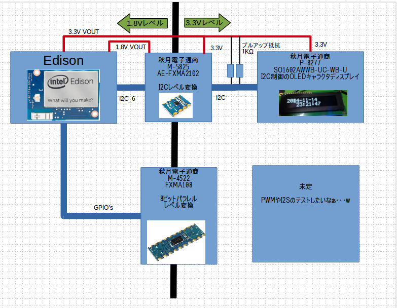
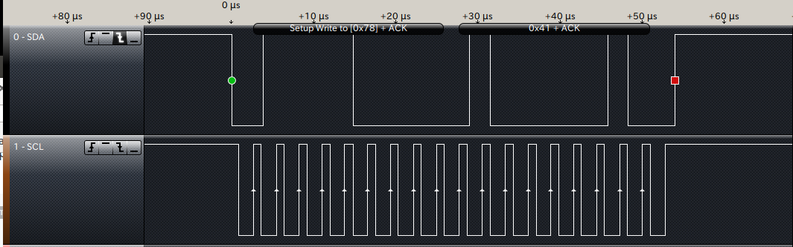
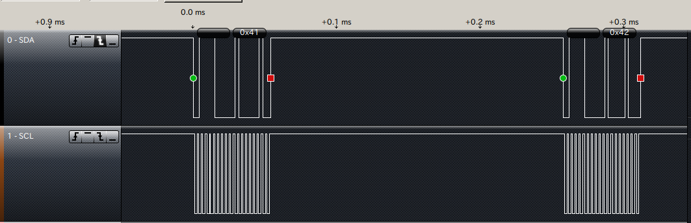
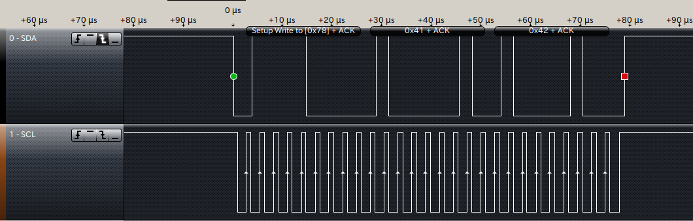

====================================================================
Edison のI2Cを試してみる
====================================================================

.. image:: img/intel.web.480.270.jpg
	:scale: 40%
	:target: http://www.intel.com/content/www/us/en/do-it-yourself/maker.html

.. image:: img/edison.png
	:scale: 40%

.. image:: img/Edison_top_view.png
	:scale: 30%
	:target: http://nonnoise.github.io/Edison/hardware.html

.. image:: img/edison02.jpg
	:scale: 30%

	
1.初めに
---------------------------

EdisonにはI2Cbusがあり、今までマイコンで相当苦労したI2CをEdisonで楽々に試せればいいなぁ～と思い、実際に使ってみることにしました。

今回、試しに制御を行ったのは、秋月電子通商で売られているOLEDディスプレイ（OLED液晶を液晶と呼ぶと怒られるので汗）
に文字を出してみようと思います。

それにしても、EdisonでI2Cは簡単ではありませんでした。相当苦労した。結局、後述のロジアナをこの為に購入してやっと分かったので、
今回の記事は色々と体張ってます汗w

2. I2C制御の試験を行う上でのハードウェア
-----------------------------------------

EdisonのIO回りはすべて1.8Vであるため、一般的なI2Cデバイスには直接接続出来ません。

そのため、一旦I2Cレベル変換を行い、デバイスに合わせたレベルで通信を行います。

今回使用したのが、秋月電子で発売されている[AE-FXMA2102] http://akizukidenshi.com/catalog/g/gM-05825/ です。

この他にも、[PCA9306]のモジュールも悪くありませんが、自分は基板に直接ハンダ付けをしたかったので、[AE-FXMA2102]を採用しました。

レベル変換ICのA側にはEdisonより1.8Vを供給し、B側にはEdisonより3.3Vを供給します。

これにより、Edison側は1.8vのI2C信号が、レベル変換ICを経由し3.3VのI2C信号として変換されます。

後日、回路図の方を作成する予定ですが、[AE-FXMA2102]に罠が2ヶ所あり、

(1) OEはHiにするとバスが有効になります。（A側のVCCに接続）未接続のままだとバスが閉じてます。

(2) B側にデバイスを接続する際はI2Cのバスをプルアップしてください。レベル変換モジュール上では行っていません。

ちょっとハマったけど、まとめたらそんな難しい話ではない。

3. EdisonのI/O回りのライブラリ　mraa
----------------------------------------------------------------------------------

EdisonやGalileoのI/O回りはmraaと言うライブラリで開発することが出来ます。

https://github.com/intel-iot-devkit/mraa

C言語の他に、Pythonでも扱うことが出来ます。ただし、スクリプト言語に関してはI/Oの速度が遅くなる為、遅くても良い箇所でPythonを使うと気が楽になります。

早速、インストールをば。

- echo "src mraa-upm http://iotdk.intel.com/repos/1.1/intelgalactic" > /etc/opkg/mraa-upm.conf
- opkg update
- opkg install libmraa0
- opkg upgrade

以上でC言語、C++、Pythonその他で使えるライブラリがインストールされました。

Edisonはまだまだ開発段階なので、定期的に
- opkg upgrade
を行った方が吉です。ほんと、いつの間にかバグが解消されていたりします。

4. PythonでI2Cを制御する
-----------------------------------------
mraaのドキュメントがあるが、Exampleを読んでもよく分からないので解説します。

http://iotdk.intel.com/docs/master/mraa/python/example.html#i2c

なお、解説方法はソフトウェアらしくなく、ハードウェアから探っていく方法です。

.. code-block:: python
	
	import mraa

	I2C_PORT = 6
	I2C_ADDR = 0x3C

	x = mraa.I2c(I2C_PORT)
	x.address(I2C_ADDR)

	x.write(0x41)

* import mraa

mraaライブラリをインポートします。無事にmraaがインストールされていれば特に問題はないはず。

* I2C_PORT = 6
* I2C_ADDR = 0x3C

Edisonには、I2CのポートがI2C_1とI2C_6の二種類あります。今回はI2C_6を使用したので、ここでポート番号とアドレスを宣言しています。（直接書き込みで省略可）

* x = mraa.I2c(I2C_PORT)

I2Cのポートを開きます。

* x.address(I2C_ADDR)

I2Cで接続するデバイスのアドレスを入力します。８ビット中、最初のビットはR/Wビットとなりますので、ここでは最初のビットを飛ばした７ビット分の数字を設定します。

例） 8bit=0x78 7bit=0x3C

* x.write(0x41)

アドレスで宣言したI2Cデバイスへデータを書き込みます。　一回のwriteにバスアドレス＋データのセットを送ります。

例えば

* x.write(0x41)
* x.write(0x42)

と、二回書き込んだ際は、

となります。

もし、ここで　バスアドレス＋レジスタアドレス＋データ　の組み合わせで通信する際は、

* x.writeReg(0x41,0x42)

となります。

この違いに気がつくまで二日かかりましたよ・・・。

基本的にはこんな所で、後はreadも似たような形で読み出しが出来ると思います。（未検証

これらの関数を組み合わせて、I2Cの制御を行っていきたいと思います。

5. PythonでOLEDディスプレイのライブラリを作る
-----------------------------------------

次回更新予定。

提供
--------------------------------

ArtifactNoise.

.. image:: img/ANlogoMark02.png
	:alt: ArtifactNoise
	:scale: 40%
	:target: http://artifactnoise.com
	
管理情報
------------------------------------------------

:初版: 2014/11/15

:作成者: Yuta kitagami
:連絡先: kitagami@artifactnoise.com
:twitter: @nonNoise

