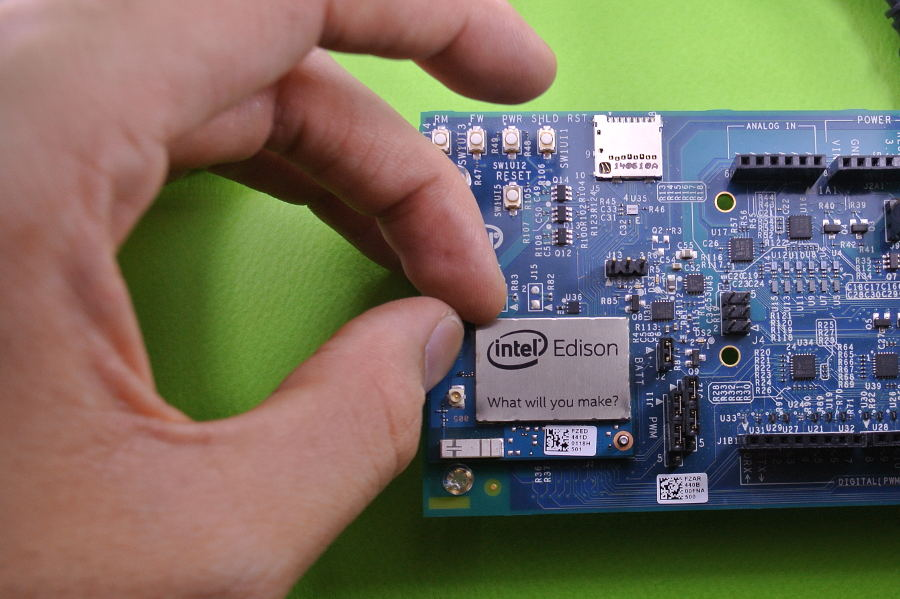

 ====================================================================
Edison開発方法 Ver2.0　　(最新 FW 2.1対応版)
====================================================================

.. image:: img/intel.web.480.270.jpg
	:scale: 40%
	:target: http://www.intel.com/content/www/us/en/do-it-yourself/maker.html

.. image:: img/Edison11.JPG
	:scale: 50%

.. image:: img/Edison_top_view.png
	:scale: 30%

nonNoise博士のEdison-ノート
--------------------------------------

最終更新日 |today|

★FW 2.1対応に向けて随時更新中！

-- **Edisonセットアップ編** --

.. toctree::
    :maxdepth: 1

    Setup/01
    Setup/02
    Setup/03

-- **ソフトウェア編** --

.. toctree::
    :maxdepth: 1

    Software/python
    Software/ntpdate

-- **ハードウェア編** --

.. toctree::
    :maxdepth: 1

    Hardware/hardware_module
    Hardware/hardware_bb
    Hardware/hardware_arduino
    Hardware/hardware_i2c

-- **応用・ネタ編** --

.. toctree::
    :maxdepth: 1

    Setup/init
    Setup/NoSpace
    memo/hikaku
    Software/bluetooth
    memo/memo

提供
--------------------------------

ArtifactNoise.

.. image:: img/ANlogoMark02.png
	:alt: ArtifactNoise
	:scale: 40%
	:target: http://artifactnoise.com

書籍化に向けて勉強中。

管理情報
------------------------------------------------

:改版: 2015/06/18  Edison Rev2に合わせて大幅に改版
:改版: 2015/01/25  EdisonArduino版をまとめました。
:改版: 2015/01/03  Edisonのセットアップ方法を新旧合体しました。
:改版: 2014/10/30  ハードウェアについて Breakout Board 編  を追記
:改版: 2014/10/27  FWの書き込み方法にWindows版を追加。
:改版: 2014/10/26  Bluetoothの開発記事を追加。
:初版: 2014/10/25

:作成者: Yuta kitagami
:連絡先: kitagami@artifactnoise.com
:twitter: @nonNoise
