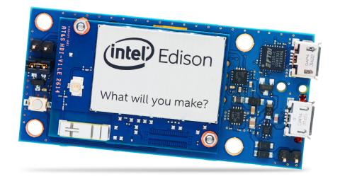
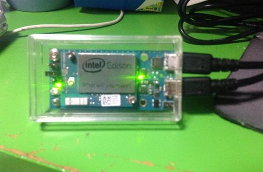
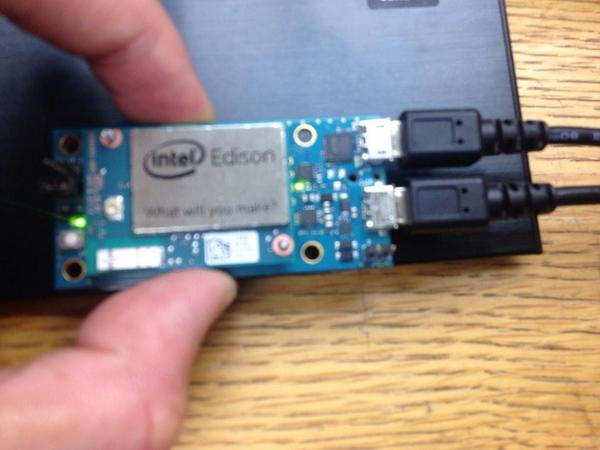

====================================================================
Edison初期化方法（工場出荷時）
====================================================================

1.Edisonを初期化出来る環境
--------------------------------------------

Edisonの初期化は結構難しい。RasPiならSDカードを交換すれば良いのだが、EdisonはオンボードのフラッシュROMなので、
外部から書き換えを行う必要があります。

Intel社から紹介されている方法は、LinuxとWindowsのみに対応しており、Macに関しては随時行うそうです。

Edisonの初期化は、本当に全部初期化にしますので、各設定類はすべて削除されます。

例えば、僕見たいにパスワードを忘れたり間違えたりして、どうにもならなくなった際に使って見てください

2.初期化ファイルのダウンロード
--------------------------------------------

https://communities.intel.com/docs/DOC-23242 より、「　Edison Yocto complete 　」
をダウンロードしてください。

ダウンロードしたら、zipファイルなので解答してください。

解答したら、コマンドプロントで解答したフォルダーまで移動します。

3. 初期化の手順
--------------------------------------------

(1) EdisonをPCに接続します

(2) PC上からを実行
	
	-Linuxの場合
		- ./flashall.sh
	-Winsowsの場合
		- ./flashall.bin

.. warning::

	自分のUnintu環境では、dfu-utilが無かった為、 「apt-get install dfu-util」を行った後に実行しました。

(3) Edisonの電源側を抜いて、差し直す。（なるべくFTDI側は残しておいた方がいいです。完了時が分かりますので)

(4) コマンドが流れて行って、１０秒近くたったら、自動的に再起動します。

(5) edison login: が表示されたが完了。

これで、どれだけ遊んでも怖くないw

参考資料
--------------------------------

http://www.adafruit.com/datasheets/EdisonUserGuide.pdf

|

|

|

|

|

|

提供
--------------------------------

ArtifactNoise.

.. image:: img/ANlogoMark02.png
	:alt: ArtifactNoise
	:scale: 40%
	:target: http://artifactnoise.com
	
管理情報
------------------------------------------------

:初版: 2014/10/25

:作成者: Yuta kitagami
:連絡先: kitagami@artifactnoise.com
:twitter: @nonNoise

